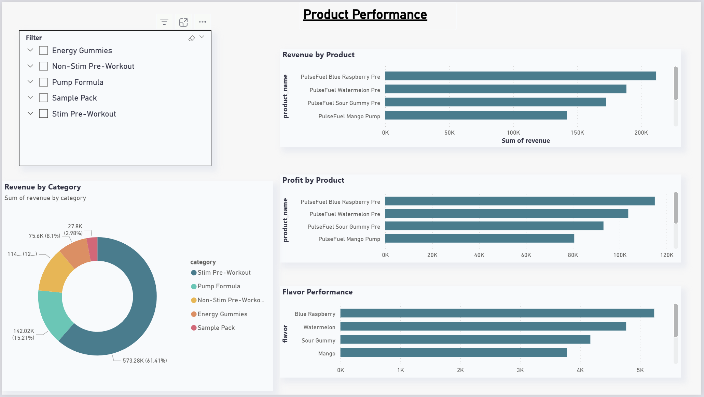

# 🚀 Sales Data Pipeline & Analytics Dashboard  

## 📊 Overview  
This project builds a complete end-to-end data pipeline and analytics system for a simulated supplement company, **PulseFuel Nutrition**. It transforms raw sales data into structured, actionable insights by combining data engineering, analysis, and visualization.

The goal was to move beyond simple analysis and create a scalable system that automates data processing, improves accessibility, and supports real-world business decision making.

---

## 🧠 What This Project Does  
- Processes 8,000+ synthetic sales transactions representing PulseFuel’s retail operations  
- Cleans and transforms messy datasets using a custom Python ETL pipeline  
- Stores structured data in PostgreSQL for efficient querying  
- Tracks key KPIs like revenue, profit, units sold, and order trends  
- Performs trend analysis and basic forecasting (moving average model)  
- Visualizes insights through an interactive Power BI dashboard  
- Simulates scalable infrastructure using Docker and Kubernetes  

---

## 🏗️ Architecture  

**Flow:**  
Raw Data → ETL Pipeline (Python) → PostgreSQL → Power BI Dashboard  

---

## 📸 Dashboard Preview  

### Revenue & Profit Analysis  

### Regional Performance  

---

## 📈 Key Metrics  
- Total Revenue  
- Total Profit  
- Units Sold  
- Total Orders  
- Average Order Value (AOV)  
- Profit Margin  

---

## 🔍 Key Insights  
- A small number of products drive the majority of total revenue  
- Sales show seasonal patterns, with spikes in key months  
- Direct-to-consumer channels (website) tend to produce stronger margins  
- Certain regions consistently outperform others  
- Entry-level products (like sample packs) support customer acquisition  

---

## 🔮 Forecasting  
A 3-month moving average model was used to estimate future revenue trends.  
The dashboard separates historical performance from projected data to simulate business planning.

---

## ⚙️ Tech Stack  
- 🐍 Python (pandas, numpy, basic modeling)  
- 🐘 PostgreSQL  
- 🐳 Docker  
- ☸️ Kubernetes (concepts applied)  
- 📊 Power BI  

---

## 🤝 Collaboration  
Worked with teammate **Anurag Veluri** to divide and build the system.  
Focused on data transformation, database structuring, and pipeline automation while collaborating on dashboard development and deployment setup.

---

## 🛠️ Key Improvements  
- Automated ETL workflows, reducing manual data processing  
- Improved data reliability through cleaning and validation  
- Structured data for faster querying and analysis  
- Enabled faster decision making through interactive dashboards  
- Simulated production-level scalability using containerization  

---

## ▶️ How to Run  
1. Clone the repository  
2. Navigate to the ETL scripts  
3. Run Docker containers  
4. Load data into PostgreSQL  
5. Connect Power BI to visualize insights  

---

## 🚀 Future Enhancements  
- Cloud deployment (AWS or GCP)  
- Real-time data streaming  
- Advanced forecasting models (ARIMA / ML)  
- API-based data ingestion  

---

## ⭐ Why This Project Matters  
This project demonstrates how raw business data can be transformed into meaningful insights through a full data pipeline, combining data engineering, analytics, and visualization.

By simulating a real company (PulseFuel Nutrition), it shows practical, real-world application of building scalable systems and making data-driven decisions.
