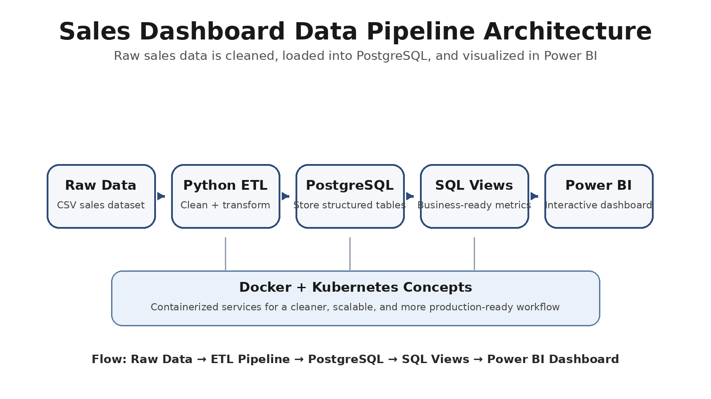
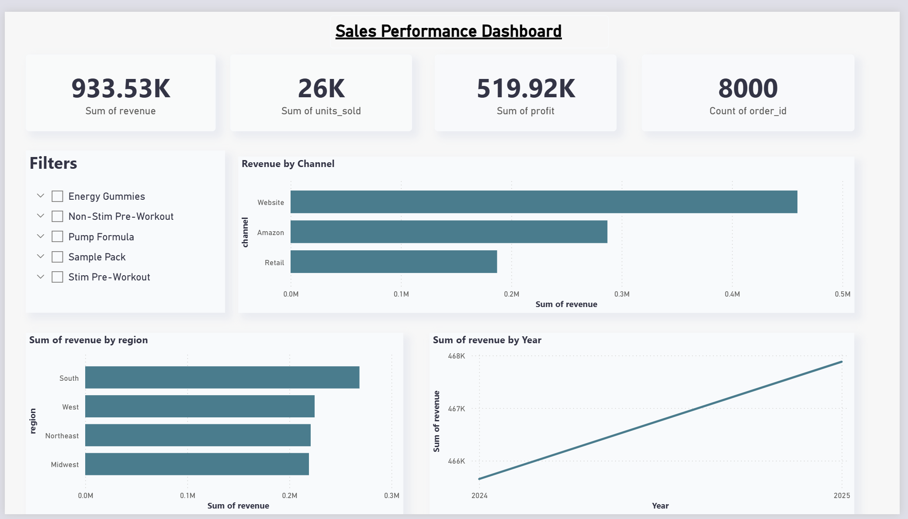

# 🚀 Sales Data Pipeline & Analytics Dashboard

## 📊 Overview
This project builds a complete data pipeline and analytics system to turn raw sales data into meaningful business insights. The system simulates a real world consumer product company and focuses on improving data accessibility, automation, and decision making.

---

## 🧠 What This Project Does
- Converts raw, messy sales data into structured formats  
- Stores data in a PostgreSQL database for efficient querying  
- Visualizes key business metrics using Power BI  
- Simulates scalable infrastructure using Docker and Kubernetes  

---

## 🏗️ Architecture

**Flow:**  
Raw Data → ETL Pipeline (Python) → PostgreSQL → Power BI Dashboard  

---

## 📸 Dashboard Preview

### Revenue & Profit Analysis

### Regional Performance

---

## ⚙️ Tech Stack
- 🐍 Python  
- 🐘 PostgreSQL  
- 🐳 Docker  
- ☸️ Kubernetes  
- 📊 Power BI  

---

## 🤝 Collaboration
Worked with teammate **Adarsh Nambiar** to divide and build the system.  
Focused on data transformation, database structuring, and pipeline automation while collaborating on dashboards and deployment setup.

---

## 🛠️ Key Improvements
- Reduced manual data processing by automating ETL workflows  
- Improved data organization and accessibility through structured storage  
- Enabled faster decision making through clear visual dashboards  
- Simulated production level scalability using containerization  

---

## ▶️ How to Run
1. Clone the repository  
2. Navigate to ETL scripts  
3. Run Docker containers  
4. Connect Power BI to the PostgreSQL database  

---

## 🚀 Future Enhancements
- Cloud deployment (AWS or GCP)  
- Real time data streaming  
- Advanced analytics and forecasting  

---

## ⭐ Why This Project Matters
This project demonstrates real world data engineering and analytics skills, combining backend data processing with business focused visualization and scalable infrastructure concepts.
